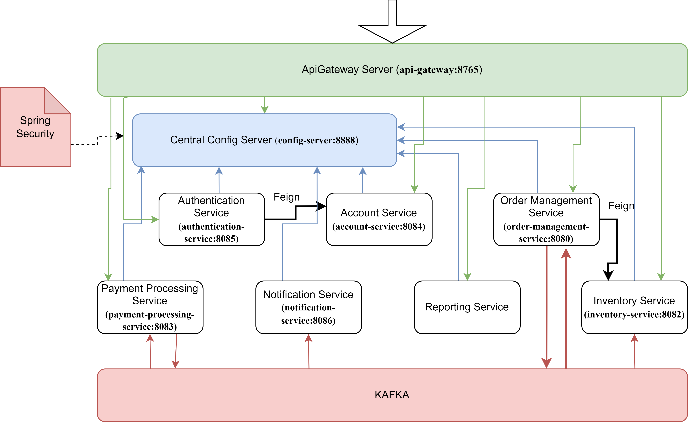

# Order Processing System

## Overview
This Order Processing System is a robust and scalable application built using a modern tech stack, showcasing my expertise in various technologies and best practices. It seamlessly handles order processing, making it efficient, reliable, and easily maintainable.

## Key Technologies & Components
- **Spring Boot:** The core framework that powers this application, providing a solid foundation for building RESTful services.

- **Spring Cloud:** Leveraging Spring Cloud for microservices architecture, making the system highly modular and easy to extend.

- **Spring Cloud Server:** Centralized configuration management for maintaining system properties efficiently.

- **Spring Security:** A comprehensive security framework for securing microservices and protecting sensitive data.

- **Feign Client:** A declarative web service client for making API requests to other microservices in a more intuitive and elegant way.

- **Eureka:** Service discovery and registration for dynamic scaling and load balancing.

- **API Gateway:** A gateway service using Spring Cloud Gateway to manage and route incoming requests efficiently.

- **Kafka:** A distributed streaming platform for real-time order processing and event-driven communication between services.

- **Docker:** Containerization for easy deployment and scalability.

## Features
- **Microservices Architecture:** The system is built as a set of microservices, enabling scalability, maintainability, and independent deployment of different components.

- **Centralized Configuration:** Spring Cloud Server helps manage configurations centrally, making it easy to maintain and scale.

- **Service Discovery:** Eureka allows services to dynamically discover and communicate with each other, improving system resilience.

- **Feign Client:** Simplifies making synchronized API calls to other microservices.

- **API Gateway:** Spring Cloud Gateway serves as a single entry point for external requests, simplifying routing and authentication.

- **Spring Security:** Ensures the security of system, protecting sensitive data and resources with authentication and authorization.

- **Event-Driven Processing:** Kafka facilitates real-time communication between services, ensuring efficient order processing and data synchronization.

## Architecture

## Getting Started
1. Clone this repository.
2. Install Docker if not already installed.
3. Run `docker-compose up` to start the entire system.

## Usage
- APIs are available in postman file ([endpoints.postman_collection.json](https://github.com/Mariiya/OrderProcessingSystem/tree/master/microservices/endpoints.postman_collection.json)) grouped by system functionality.

## Future Enhancements
- Implement distributed access to functionality by user roles.
- Add featured search and reporting engine.
- Add monitoring and logging for better system observability.
- Introduce automated testing and CI/CD pipelines.

Feel free to reach out for any questions or collaboration opportunities!
mariakozusan@gmail.com
